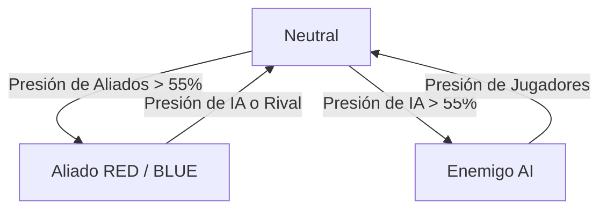

# Documento de Diseño de Juego (GDD) - SPEAKERDUST
**Versión del Documento:** 1.0 (Basado en el Código Fuente v4)  
**Género:** Shooter Espacial / Combate Naval Táctico Multijugador Cooperativo  
**Tecnología:** Cloudflare Workers, Cloudflare Durable Objects, Cloudflare D1 SQL, HTML5 Canvas (Vanilla JS), Web Audio API  

---

## 1. Visión General del Juego

**SPEAKERDUST** es un videojuego de combate espacial multijugador en tiempo real con dinámicas inspiradas en la guerra naval clásica (inercia pesada, posicionamiento y gestión de calor). Los jugadores toman el papel de capitanes espaciales integrados en flotas rivales (**Equipo Rojo** o **Equipo Azul**) que deben cooperar para repeler oleadas de la flota enemiga de la IA, al mismo tiempo que compiten por el dominio estratégico de puntos de control clave ubicados en un mapa bidimensional.

### Pilares de Diseño
1. **Física de Combate Inercial (Naval Espacial):** Las naves se desplazan usando mecánicas de fricción espacial, masa pesada y retroceso físico de armamento. No es un shooter instantáneo (twitch shooter); requiere planeación del rumbo.
2. **Dominio de Objetivos y Zonas:** Controlar puntos en el mapa no es opcional. Las zonas capturadas otorgan reparaciones vitales, enfriamiento de armas rápido, regeneración de escudos y puntos de victoria.
3. **Cooperación y Escalamiento de Clases:** Naves que van desde ágiles corbetas de exploración hasta colosales acorazados de batalla cooperan en un entorno PvE/PvP dinámico donde las oleadas de enemigos crecen exponencialmente.

---

## 2. Mecánicas del Sistema de Combate y Vuelo

### 2.1 Movimiento y Controles de Vuelo
El movimiento simula una nave en agua o atmósfera pesada usando vectores de aceleración e inercia:
*   **Rotación Táctica:** El jugador apunta la nave girando suavemente hacia la dirección del cursor del ratón (`angle` y `targetAngle`).
*   **Empuje (Thrust & Strafe):** Controlado con teclado (`WASD` / Flechas). El empuje frontal (`inputForward`) empuja la nave en el eje de su ángulo actual. El empuje lateral (`inputStrafe`) desplaza la nave perpendicularmente para maniobras de esquiva.
*   **Fricción Espacial (Drag):** Las naves pierden velocidad progresivamente de acuerdo con su factor de resistencia (`drag`). Su velocidad máxima real está limitada (`maxSpeed`).
*   **Sobretensión del Motor (Engine Surge / Boost):** Activado presionando `Shift` o `Clic Derecho`. Otorga un impulso instantáneo de velocidad de gran alcance (`impulse = 1.2 / mass`).
    *   **Costo:** 34 unidades de energía (el máximo es 100).
    *   **Regeneración Base:** 0.38 unidades por tick.
    *   **Enfriamiento de Propulsor:** 120 ticks (aprox. 4 segundos).

### 2.2 Física de Límites de Mapa y Colisiones
*   **Límites del Mundo:** El mapa mide $1200 \times 800$ píxeles. Si una nave choca contra los bordes, su posición se fija en el margen exterior y se aplica un rebote físico atenuado (`vx *= -0.22` o `vy *= -0.22`).
*   **Colisiones entre Naves:** Al colisionar naves aliadas/enemigas, se resuelven empujes de penetración basados en su masa relativa y posición. Si la velocidad relativa supera el umbral de daño por impacto (`5.8`), ambas naves reciben daño estructural por impacto físico.

### 2.3 Capas de Daño y Blindaje
Las naves de Speakerdust poseen tres capas jerárquicas de protección que se mitigan en secuencia:
1.  **Escudo de Energía (Shield):** El escudo absorbe todo el daño de un proyectil estándar a costa de perder una carga (`shield -= 1`). Si el escudo es impactado, entra en retraso de recarga (`SHIP_SHIELD_REGEN_DELAY = 150` ticks). Tras este tiempo, regenera una carga cada `SHIP_SHIELD_REGEN_INTERVAL = 190` ticks.
2.  **Blindaje de Placas (Armor):** Si no hay escudo, el blindaje mitiga el daño del proyectil absorbiendo el 50% redondeado hacia arriba (`absorbed = ceil(damage * 0.5)`). El daño restante atraviesa al casco. Ciertas armas (como el Railgun) ignoran el blindaje (perforantes).
3.  **Integridad Estructural (Hull HP):** La salud base de la nave. Si el casco llega a 0, la nave explota (`alive = false`).
*   **Marcos de Invencibilidad (iFrames):** Al recibir daño, la nave entra en un estado temporal inmune a daños para evitar la muerte instantánea:
    *   Impactos de proyectil al casco/armadura: 10 ticks.
    *   Impactos de proyectil al escudo: 14 ticks.
    *   Colisión física: 7-8 ticks.

---

## 3. Clases de Naves de Jugador

Los jugadores pueden pilotar y reaparecer con diferentes clases de naves espaciales, cada una con un rol diferenciado en el campo de batalla:

| Clase | Nombre Comercial | Rol del Diseño | HP Máx | Escudo | Armadura | Masa | Drag (Fricción) | Vel. Máx | Thrust (Fuerza) | Strafe (Fuerza) | Turn Rate | Ranuras de Arma |
| :--- | :--- | :--- | :---: | :---: | :---: | :---: | :---: | :---: | :---: | :---: | :---: | :--- |
| **corvette** | Scout Corvette | Escolte y exploración | 5 | 2 | 1 | 1.0 | 0.982 | 3.60 | 0.220 | 0.080 | 0.085 | Naval Cannon, Autocannon, Torpedo, Railgun |
| **destroyer** | Destroyer | Combate de línea | 8 | 1 | 3 | 1.6 | 0.988 | 2.70 | 0.160 | 0.035 | 0.055 | Naval Cannon, Autocannon, Torpedo, EMP Launcher |
| **missile_frigate** | Missile Frigate | Presión a distancia | 7 | 1 | 2 | 1.45 | 0.987 | 2.90 | 0.170 | 0.040 | 0.060 | Guided Missile, Torpedo, Autocannon, EMP Launcher |
| **cruiser** | Cruiser | Control de zona | 11 | 2 | 4 | 2.2 | 0.991 | 2.15 | 0.120 | 0.020 | 0.043 | Plasma Broadside, Naval Cannon, Energy Bomb, Railgun |
| **battlecruiser** | Battlecruiser | Persecución pesada | 14 | 2 | 5 | 2.7 | 0.992 | 1.95 | 0.105 | 0.015 | 0.036 | Railgun, Naval Cannon, Guided Missile, Plasma Broadside |
| **battleship** | Battleship | Artillería dominante | 18 | 2 | 7 | 3.4 | 0.994 | 1.55 | 0.080 | 0.008 | 0.027 | Naval Cannon, Railgun, Plasma Broadside, Energy Bomb |
| **dreadnought** | Dreadnought | Ancla de la flota | 26 | 3 | 10 | 4.6 | 0.996 | 1.15 | 0.055 | 0.004 | 0.018 | Railgun, Plasma Broadside, Naval Cannon, Energy Bomb |

---

## 4. Sistema de Armas y Balística

### 4.1 Sistema de Disipación de Calor y Retroceso
*   **Calor del Arma (Heat):** Cada disparo genera calor acumulado (`weaponHeat`). Al superar el límite `SHIP_HEAT_LIMIT = 100`, la nave puede continuar disparando acumulando un buffer de calor de seguridad (máximo 140), tras el cual el arma se bloquea por sobrecalentamiento. El calor se disipa pasivamente a una velocidad de `0.55` unidades por tick.
*   **Retroceso Físico (Recoil):** Disparar genera una fuerza de empuje opuesta al vector de disparo (`impulse = recoil / mass`), reduciendo la velocidad de avance de la nave o desplazándola hacia atrás.
*   **Modo de Disparo Cargado (Carga y Telégrafo):** Ciertas armas (como el Railgun o Plasma Broadside) no disparan de forma instantánea. Tienen un retardo de carga (`chargeTicks`). Al activarse, envían una alerta visual al resto de jugadores en red mostrando la trayectoria o el área de impacto (`telegraphColor`) antes de liberar los proyectiles.

### 4.2 Especificaciones del Armamento

| Identificador | Nombre en Interfaz | Daño | Cooldown | Calor | Velocidad | Rango de Vida | Radio Proyectil | Retroceso | Radio Splash | Ticks Carga | Arco de Disparo | Efectos Especiales / Notas |
| :--- | :--- | :---: | :---: | :---: | :---: | :---: | :---: | :---: | :---: | :---: | :--- | :--- |
| **naval_cannon** | Naval Cannon | 3 | 54 | 24 | 8.2 | 120 | 8 | 1.15 | 28 | 0 | Frontal | Proyectil de artillería de alto impacto con daño de área leve. |
| **autocannon** | Autocannon | 1 | 12 | 7 | 10.5 | 65 | 4 | 0.25 | 0 | 0 | Frontal | Disparo continuo antiaéreo rápido y de baja dispersión. |
| **plasma_broadside** | Plasma Broadside | 2 | 82 | 34 | 5.4 | 95 | 10 | 0.70 | 42 | 18 | Lateral | Dispara ráfagas dobles hacia babor y estribor (laterales). |
| **railgun** | Railgun | 6 | 104 | 42 | 18.0 | 48 | 5 | 1.75 | 14 | 24 | Frontal | Disparo cargado de alta velocidad. Perfora el blindaje directamente. |
| **torpedo** | Torpedo | 7 | 96 | 20 | 3.4 | 190 | 12 | 0.45 | 72 | 0 | Frontal | Autoguiado lento (`turnRate = 0.018`), daño y splash destructivos. |
| **guided_missile** | Guided Missile | 4 | 72 | 26 | 5.7 | 150 | 9 | 0.35 | 48 | 0 | Omnidireccional | Proyectil con alta capacidad de rastreo (`turnRate = 0.055`). |
| **energy_bomb** | Energy Bomb | 4 | 90 | 32 | 4.0 | 84 | 11 | 0.50 | 92 | 8 | Omnidireccional | Mina espacial detonante que explota al agotar su vida útil. |
| **emp_launcher** | EMP Launcher | 1 | 76 | 24 | 6.4 | 100 | 9 | 0.30 | 58 | 0 | Omnidireccional | Aplica efecto de parálisis EMP (`empTicks = 80`) al objetivo. |

---

## 5. Dinámica de Objetivos y Zonas de Captura

El combate gira en torno a tres puntos estratégicos fijos en el mapa. Cada zona puede estar en posesión de los jugadores (Equipo Rojo o Azul), las naves enemigas de la IA, o permanecer Neutral.



### 5.1 Mecánica de Captura
*   **Detección de Presión:** Si una nave activa está dentro del radio del objetivo, genera presión de captura según su distancia al centro:
    $$\text{Presión} = \left(1 - \frac{\text{Distancia}}{\text{Radio de la Zona}}\right) \times 0.72 \times \text{Escala de Presión de Zona}$$
*   **Conflicto y Decaimiento:** Si naves aliadas y enemigas ocupan la misma zona, las presiones se restan. Si no hay nadie en la zona, el progreso capturado decae pasivamente a una tasa de `0.28` por tick.
*   **Límite de Captura:** Para que una facción sea considerada propietaria de la zona, debe llevar su barra de progreso a un umbral mínimo del `55%` (`ZONE_CAPTURE_THRESHOLD`).

### 5.2 Estructuras de Objetivos Activos

1.  **Refinería de Energía (ENERGY REFINERY):**
    *   **Ubicación:** Centro del Mapa ($600, 400$) | **Radio:** 150 píxeles.
    *   **Bonificaciones al Propietario:** Aceleración drástica de disipación de calor de armas (`+0.22/tick`) y regeneración de escudos impulsada.
2.  **Relé de Comunicaciones (COMMS RELAY):**
    *   **Ubicación:** Cuadrante Izquierdo Superior ($300, 240$) | **Radio:** 132 píxeles.
    *   **Bonificaciones al Propietario:** Facilidad de captura masiva debido a su alta tasa de influencia de presión de captura (`x1.25`).
3.  **Plataforma de Recursos (RESOURCE PLATFORM):**
    *   **Ubicación:** Cuadrante Derecho Inferior ($888, 560$) | **Radio:** 132 píxeles.
    *   **Bonificaciones al Propietario:** Incremento constante de puntaje del jugador y autoreparación lenta del casco.

### 5.3 Tabla de Bonificaciones por Ocupación (Objective Bonuses)

| Tipo de Objetivo | Enfriamiento de Calor | Reg. Energía Boost | Mitigación Shield Delay | Ticks Auto-Reparación | Ticks Puntos (+1 Score) | Escala Presión Captura |
| :--- | :---: | :---: | :---: | :---: | :---: | :---: |
| **resource_platform** | +0.05 | +0.05 | -0 | *Sin Recarga* | Cada 14 ticks | 1.05 |
| **comms_relay** | +0.04 | +0.04 | -0 | *Sin Recarga* | Cada 18 ticks | 1.25 |
| **energy_refinery** | +0.22 | +0.24 | -1 tick | *Sin Recarga* | Cada 22 ticks | 1.00 |
| **naval_base** | +0.08 | +0.08 | -2 ticks | Cada 180 ticks | Cada 20 ticks | 1.00 |
| **radar_station** | +0.06 | +0.06 | -0 | *Sin Recarga* | Cada 18 ticks | 1.15 |
| **supply_convoy** | +0.10 | +0.16 | -1 tick | Cada 240 ticks | Cada 12 ticks | 1.00 |

---

## 6. Inteligencia Artificial (La Flota Enemiga)

La Flota Enemiga es controlada de forma centralizada por el servidor. Su objetivo es cazar capitanes de jugadores y disputar las zonas de control del mapa.

### 6.1 Comportamiento y Algoritmos de Navegación de IA
*   **Caza Activa:** Si hay jugadores con vida dentro del radio de alcance del sensor de la IA ($860$ píxeles), la nave enemiga selecciona al capitán más cercano.
*   **Puntería Predictiva (Leading Targets):** El sistema de tiro de la IA calcula el vector de velocidad del jugador para apuntar por delante del curso de vuelo del jugador:
    *   Naves estándar: Predicen la posición del jugador a 18 ticks en el futuro.
    *   Acorazados y Dreadnoughts: Predicen la posición a 28 ticks en el futuro (debido al tiempo de viaje de sus armas pesadas).
*   **Navegación Táctica de Flotas:**
    *   *Órbita Dinámica:* Los enemigos orbitan al jugador basándose en su clase e índice de formación para dispersar el fuego de respuesta del jugador.
    *   *Evitación de Rangos:* Si un jugador se acerca demasiado, las clases ligeras retroceden activamente (`retreat`), mientras que si el jugador se aleja de su rango ideal de combate (`idealRange`), la nave acelera para cerrar la distancia (`seek`).
*   **Captura de Zonas Autónoma:** Si no hay capitanes jugadores en el sensor de los enemigos, la IA busca la zona de control más cercana del mapa para disputar su control y comenzar su captura.

### 6.2 Clases de Naves Enemigas e IA

| Tipo de IA | Clase Asociada | Vida Base | Multiplicador Recarga Arma | Rango Ideal | Arma Preferida | Valor en Puntos |
| :--- | :--- | :---: | :---: | :---: | :--- | :---: |
| **corvette** | corvette | $5 + \text{Bonus Wave}$ | 0.85 | 250 px | Autocannon | 120 pts |
| **destroyer** | destroyer | $8 + \text{Bonus Wave}$ | 1.00 | 330 px | Naval Cannon | 260 pts |
| **frigate** | missile_frigate | $6 + \text{Bonus Wave}$ | 1.08 | 410 px | Guided Missile | 320 pts |
| **cruiser** | cruiser | $12 + \text{Bonus Wave}$ | 1.12 | 430 px | Plasma Broadside | 520 pts |
| **battleship** | battleship | $21 + \text{Bonus Wave}$ | 1.28 | 520 px | Railgun | 900 pts |
| **dreadnought** | dreadnought | $34 + \text{Bonus Wave}$ | 1.45 | 580 px | Railgun | 1600 pts |

*   **Bonus de Vida por Oleada:** La dificultad escala incrementando la salud de todos los enemigos en $+1$ HP por cada 4 oleadas transcurridas (`hpBonus = floor((wave - 1) / 4)`).
*   **Composición de Oleadas:** El número de enemigos generados por oleada aumenta dinámicamente según la siguiente fórmula:
    *   *Corvetas:* $\min(2 + \lceil\text{wave} \times 0.8\rceil, 12)$
    *   *Destructores:* $\min(\max(1, \lfloor\text{wave} / 2\rfloor), 7)$
    *   *Fragatas:* $\min(\max(0, \lfloor(\text{wave} - 2) / 3\rfloor), 5)$
    *   *Cruceros:* $\min(\max(0, \lfloor(\text{wave} - 4) / 4\rfloor), 4)$
    *   *Acorazados:* $\min(\max(0, \lfloor(\text{wave} - 7) / 5\rfloor), 2)$
    *   *Dreadnoughts:* $1$ unidad (solo en oleadas $\ge 12$ que sean múltiplos de 4).

---

## 7. Arquitectura Técnica e Infraestructura de Servidor

El juego está diseñado con una arquitectura moderna de computación en el borde (Edge Computing) de Cloudflare, optimizada para juegos multijugador asíncronos y de sesión rápida.

```
┌────────────────────────────────────────────────────────────────────────┐
│                              Navegador Web                             │
│       (HTML5 Canvas - Renderer @ ~30FPS | Web Audio API - Sonido)      │
└───────────────────────────────────┬────────────────────────────────────┘
                                    │
                                    │ WebSockets (Mensajes JSON)
                                    ▼
┌────────────────────────────────────────────────────────────────────────┐
│                         Cloudflare Workers (Borde)                     │
│    (Valida rutas de salas /room/<id> e inicia enlace de socket)        │
└───────────────────────────────────┬────────────────────────────────────┘
                                    │
                                    │ Durable Object Stub
                                    ▼
┌────────────────────────────────────────────────────────────────────────┐
│                    Cloudflare Durable Object: GameRoom                 │
│      - Ciclo físico a 33ms (TICK_MS)                                   │
│      - Motor de colisiones y balística                                 │
│      - Base de Datos D1 SQL (users / rooms)                            │
│      - Cola de Persistencia de estado en almacenamiento local KV       │
└────────────────────────────────────────────────────────────────────────┘
```

### 7.1 Durable Objects como Servidores de Sala (`GameRoom`)
Cada partida multijugador está administrada por una instancia física aislada y persistente en el borde de Cloudflare llamada `GameRoom`.
*   **Frecuencia del Servidor (Tick Rate):** Corre un bucle físico central regulado por un temporizador a `33 milisegundos` (aprox. 30 actualizaciones por segundo).
*   **Persistencia Activa:** El estado completo del juego (naves, zonas, oleada, ticks) se serializa en segundo plano y se guarda de manera segura en el almacenamiento de Durable Objects cada 30 ticks (aproximadamente cada segundo) si hay cambios de estado.
*   **Seguridad y Control de Tasa (Rate Limiting):**
    *   *Movimiento:* Máximo 1 actualización por cada 16ms para mitigar exploits de velocidad (desconexiones de red forzadas).
    *   *Disparo:* Restringido dinámicamente al tick actual de juego para evitar inyección de ráfagas automáticas ilegales.
    *   *Propulsión:* Tasa máxima de boost de 100ms en red.

### 7.2 Base de Datos SQL (Cloudflare D1)
El entorno está enlazado a una base de datos D1 local SQL con la siguiente estructura de tablas relacionales:
*   **Tabla `users`:** Registra el perfil del capitán (User ID persistente, Username en interfaces, nivel de cuenta y monedas acumuladas en juego).
*   **Tabla `rooms`:** Guarda la información de salas de batalla activas creadas (Room ID, Nombre, Estado de privacidad y UID del creador).

### 7.3 Generación de Audio Procedural e Interactivo
El cliente de Speakerdust no descarga archivos de música ni efectos MP3/WAV. En su lugar, utiliza **Web Audio API** para sintetizar sonido dinámico interactivo directamente en el procesador del cliente:
*   **Tono de Propulsión (Boost):** Onda de tipo `square` barriendo de 180Hz a 90Hz durante 0.08 segundos.
*   **Cañones y Railguns:** Ondas cuadradas a 880Hz que barren exponencialmente hasta 1360Hz para simular el impacto ultrasónico del disparo.
*   **Armas de Plasma / Autocañones:** Ondas triangulares triples que oscilan entre 620Hz y 1040Hz.
*   **Misiles y Torpedos:** Mezcla sibilante de ondas de sierra (`sawtooth`) de baja frecuencia con barrido de decaimiento en tiempo real.
*   **Explosiones y Colisiones:** Ruido blanco modelado digitalmente mediante un filtro pasabanda (`bandpass`) centrado a 520Hz.

---

## 8. Controles y Consola de Administración

El juego incorpora un panel oculto de administración de red (invocado presionando `Ctrl + Shift + A` e introduciendo la contraseña `ADMIN_KEY` del entorno del servidor) que permite las siguientes operaciones directas de depuración y balanceo:
1.  **Reset All:** Fuerza una reaparición de todos los capitanes jugadores con valores iniciales y limpia las puntuaciones a cero.
2.  **Clear Hostiles:** Elimina todas las naves de la IA activas en el mapa de juego para concluir una oleada conflictiva.
3.  **Set Fleet Wave:** Modifica el nivel de la oleada actual e inmediatamente genera una flota enemiga con la composición y fuerza correspondiente a ese nivel.
4.  **Force Team Selection:** Modifica las asignaciones del capitán al Equipo Rojo, Azul o lo posiciona como Espectador libre.
5.  **Kick Captain:** Desconecta forzosamente a un cliente problemático enviando una señal de socket cerrada con estado 1000.
